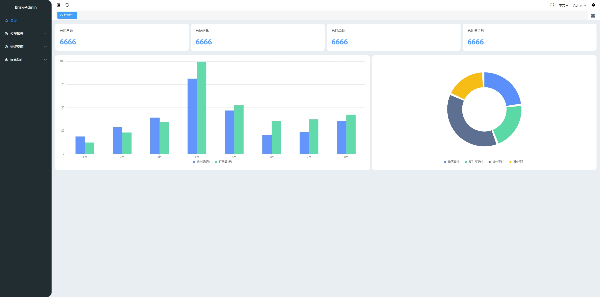

## 简介

基于原项目将npm包更新到了最新版本，并对文件做了简化，使前后端分离项目开箱即用



## 安装使用

- 获取项目代码

```bash
git clone https://github.com/wuzehv/vue3-simple-admin-js.git your-project-name
```

- 安装依赖

```bash
cd your-project-name
npm install
```

- 运行

```bash
npm run dev
```

- 打包

```bash
npm run build
```

## 开发流程

